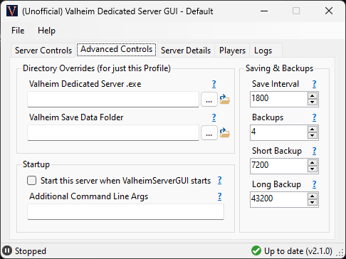

# ValheimServerGUI

A simple user interface for running a [Valheim](https://www.valheimgame.com/) Dedicated Server on your Windows PC.

Download the [latest release here](https://github.com/runeberry/ValheimServerGUI/releases). It's just a single, small .exe file!

Need help? Join our [Discord server](https://discord.gg/HBsNJTY) to ask questions or give feedback, or check out [Online Manual](https://github.com/runeberry/ValheimServerGUI/wiki) for answers to some common questions.

**Disclaimer:** _This is a fan-made project. Runeberry Software is not affiliated with Valheim or Iron Gate Studio in any official capacity. Use at your own risk!_

<table width="100%" align="center">
  <tr>
    <td></td>
    <td></td>
  </tr>
  <tr>
    <td></td>
    <td></td>
  </tr>
</table>

## Requirements

In order to run ValheimServerGUI, you will need the following:

* **Windows 10 or 11 x64-based PC** - Other Windows configurations may or may not work. 🤷‍♀
* **.NET 6 Desktop Runtime** - If you don't have it, you should be prompted to install it when you first run this app. Otherwise, you can install the latest release [here](https://dotnet.microsoft.com/download/dotnet/6.0) (under ".NET Desktop Runtime 6.X.X").
* **Valheim Dedicated Server** - Comes free with your purchase of Valheim. See the installation guide [here](https://github.com/runeberry/ValheimServerGUI/wiki/Installing-Valheim-Dedicated-Server).

## Features

* **It remembers!** - Stores your server info between sessions, and it can't be overwritten by Steam
* **Status updates** - Clearly shows when your server is running, starting, or stopping
* **Online players** - Show which players are online or offline, and when they arrived/left
* **Cross-platform support** - Recognizes players from Steam and Xbox platforms
* **Easy IP address** - No more guessing, copy the right IP address to give to your friends straight from the app
* **Cleaner server logs** - Eliminates a lot of the noisy debug logs produced by the server
* **Input validation** - Prevents you from creating a server with bad info that would fail to launch
* **Safe shutdowns** - Safely stops the server when you close the app or shut down Windows
* **Automatic startup** - If enabled, can automatically start up your server when Windows starts
* **Minimize to tray** - Minimize this app and control your server entirely from the Windows system tray
* **Multi-server support** - Run multiple servers at once by creating separate server profiles (see [FAQs](https://github.com/runeberry/ValheimServerGUI/wiki/Frequently-Asked-Questions) for details)
* **Works with mods!** - Tested and working with server-side mods such as ~~[Valheim Plus](https://www.nexusmods.com/valheim/mods/4)~~ "**NEW** [Valheim Plus](https://www.nexusmods.com/valheim/mods/2323)".

## Quick guide

1. Launch ValheimServerGUI.exe.
2. Enter your desired Server Name and Password. You don't need to change the Port in most cases.
3. Select the world you want to host, or enter a new world name.
4. Eheck any additional join options you want enabled:
  * **Community Server** will show your server in the server browser in-game.
  * **Enable Crossplay** will allow players on any platform to join with an Invite Code
1. Click "Start Server". When the status bar reads "Running", you're ready to play! You can copy your server's IP address or Invite Code from the Server Details tab to share with friends.

## FAQs

Why choose a dedicated server, and why use ValheimServerGUI? Find the answers on our [FAQs page](https://github.com/runeberry/ValheimServerGUI/wiki/Frequently-Asked-Questions).

## Contributing

Interested in contributing code to ValheimServerGUI? Check out the guidelines and full developer's guide [here](CONTRIBUTING.md).

## Support

Got suggestions, feedback, or want to report a bug? Here's how you can reach me:

* Post in the **#vsg-support** channel on our [Discord](https://discord.gg/HBsNJTY) server.
* Create a [GitHub issue](https://github.com/runeberry/ValheimServerGUI/issues/new) - Include as many details as you can for bug reports!
* Submit a bug report in the app itself (Help > Submit a Bug Report). This will include logs & machine info to help troubleshoot the problem.
* Send me an email - feedback@runeberry.com

## Donate

Do you like open-source gaming projects like this one? Want to see more of them? [Buy me a coffee](https://www.buymeacoffee.com/runeberry) to show your support! And check out my other projects on the [main site](https://runeberry.com).
