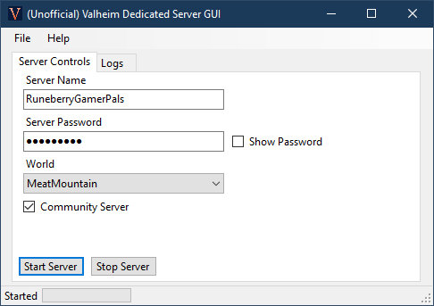

# ValheimServerGUI

A simple user interface for running a [Valheim](https://www.valheimgame.com/) Dedicated Server on your Windows PC.

Download the [latest release here](https://github.com/runeberry/ValheimServerGUI/releases). It's just a single, small .exe file!

Need help? You can find support articles in the [Online Manual here](https://github.com/runeberry/ValheimServerGUI/wiki).

**Disclaimer:** _This is a fan-made project. Runeberry Software is not affiliated with Valheim or Iron Gate Studio in any official capacity. Use at your own risk!_

  

## Requirements

In order to run ValheimServerGUI, you will need the following:

* **Windows 10 x64-based PC** - Other Windows configurations may or may not work. 🤷‍♀
* **.NET 5 Desktop Runtime** - If you don't have it, you should be prompted to install it when you first run this app. Otherwise, you can install the latest release [here](https://dotnet.microsoft.com/download/dotnet/5.0) (under ".NET Desktop Runtime 5.X.X").
* **Valheim Dedicated Server** - Comes free with your purchase of Valheim. See the installation guide [here](https://github.com/runeberry/ValheimServerGUI/wiki/Installing-Valheim-Dedicated-Server).

## Quick guide

1. Launch ValheimServerGUI.exe.
2. Enter your desired Server Name and Password. You don't need to change the Port in most cases.
3. Select the world you want to host.
4. If you want your server to appear in the Community Server list within Valheim, check "Community Server". If you leave it unchecked, players will need to "Join by IP" in-game.
5. Click "Start Server". When the status bar reads "Running", you're ready to play!

## FAQs

### What is a dedicated server?

A dedicated server allows you to run the multiplayer component of Valheim in the background without having the whole game running. This lets other players hop in and out of your multiplayer game event while you (the host) are not actively playing.

### Why would I want to run a dedicated server?

Running a dedicated server from your own PC has a few benefits:

* As host, you can run a game for your friends without needing to actively play the game at the same time.
* This means if you leave your PC on with the dedicated server running, you can have your friends play while you're away, at work, or asleep, without having to worry about your own character getting mauled by a wandering Greyling.
* You can hop to your own single-player world while still hosting a multiplayer game - so you can access that personal stash of iron we all know you're pulling from.
* You could get all these benefits from a paid server provider as well, but this is 100% free - as long as you're willing to leave your PC on!

### Why should I use ValheimServerGUI?

Currently, running a dedicated server is a little hacky and involves editing a batch file that may get overwritten by Steam. This may improve over time (it is Early Access, after all), but for now I've written this application that will do the same thing just by editing a few form fields.

You also get the following features for free:

* **It remembers!** - Stores your server info between sessions, and it can't be overwritten by Steam
* **Status updates** - Clearly shows when your server is running, starting, or stopping
* **Cleaner server logs** - eliminates a lot of the noisy debug logs produced by the server
* **Input validation** - Prevents you from creating a server with bad info that would fail to launch
* **Safe shutdowns** - Safely stops the server when you close the app or shut down Windows
* **Minimize to tray** - Minimize this app and control your server entirely from the Windows system tray

## Features coming soon

* **New worlds** - Create a new world from within the app without having to launch Valheim
* **Worlds manager** - View, delete, or backup your worlds from within the app
* **Online players** - Show which players are online or offline, and when they arrived/left
* **Ban list management** - Manage your servers ban/allow lists from within the app

## Support

Got suggestions, feedback, or want to report a bug? Here's how you can reach me:

* Create a [GitHub issue](https://github.com/runeberry/ValheimServerGUI/issues/new) - Include as many details as you can for bug reports!
* Tweet me - [@Runeberries](https://twitter.com/Runeberries)
* Send me an email - feedback@runeberry.com

## Donate

Do you like open-source gaming projects like this one? Want to see more of them? [Buy me a coffee](https://www.buymeacoffee.com/runeberry) to show your support! And check out my other projects on the [main site](runeberry.com).
