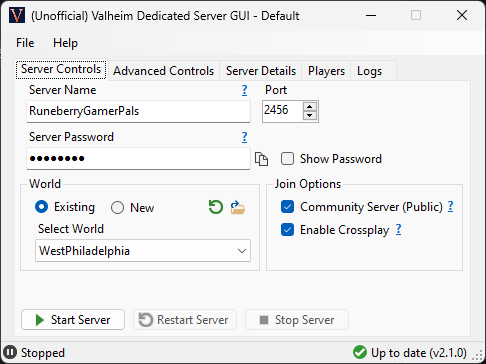
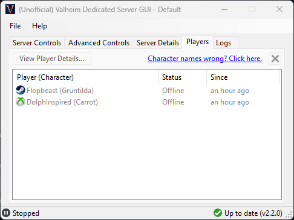
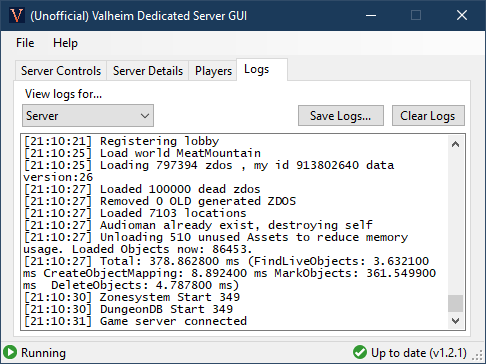

# ValheimServerGUI

A simple user interface for running a [Valheim](https://www.valheimgame.com/) Dedicated Server on your Windows PC.

Download the [latest release here](https://github.com/runeberry/ValheimServerGUI/releases). It's just a single, small .exe file!

Need help? You can find support articles in the [Online Manual here](https://github.com/runeberry/ValheimServerGUI/wiki).

**Disclaimer:** _This is a fan-made project. Runeberry Software is not affiliated with Valheim or Iron Gate Studio in any official capacity. Use at your own risk!_

<table width="100%" align="center">
  <tr>
    <td></td>
    <td></td>
  </tr>
  <tr>
    <td></td>
    <td></td>
  </tr>
</table>

## Requirements

In order to run ValheimServerGUI, you will need the following:

* **Windows 10 x64-based PC** - Other Windows configurations may or may not work. 🤷‍♀
* **.NET 5 Desktop Runtime** - If you don't have it, you should be prompted to install it when you first run this app. Otherwise, you can install the latest release [here](https://dotnet.microsoft.com/download/dotnet/5.0) (under ".NET Desktop Runtime 5.X.X").
* **Valheim Dedicated Server** - Comes free with your purchase of Valheim. See the installation guide [here](https://github.com/runeberry/ValheimServerGUI/wiki/Installing-Valheim-Dedicated-Server).

## Features

* **It remembers!** - Stores your server info between sessions, and it can't be overwritten by Steam
* **Status updates** - Clearly shows when your server is running, starting, or stopping
* **Online players** - Show which players are online or offline, and when they arrived/left
* **Easy IP address** - No more guessing, copy the right IP address to give to your friends straight from the app
* **Cleaner server logs** - Eliminates a lot of the noisy debug logs produced by the server
* **Input validation** - Prevents you from creating a server with bad info that would fail to launch
* **Safe shutdowns** - Safely stops the server when you close the app or shut down Windows
* **Automatic startup** - If enabled, can automatically start up your server when Windows starts
* **Minimize to tray** - Minimize this app and control your server entirely from the Windows system tray

### Coming soon...

* **Worlds manager** - View, delete, or backup your worlds from within the app
* **Ban list management** - Manage your servers ban/allow lists from within the app

## Quick guide

1. Launch ValheimServerGUI.exe.
2. Enter your desired Server Name and Password. You don't need to change the Port in most cases.
3. Select the world you want to host, or enter a new world name.
4. If you want your server to appear in the Community Server list within Valheim, check "Community Server". If you leave it unchecked, players will need to "Join by IP" in-game.
5. Click "Start Server". When the status bar reads "Running", you're ready to play!

## FAQs

Why choose a dedicated server, and why use ValheimServerGUI? Find the answers on our [FAQs page](https://github.com/runeberry/ValheimServerGUI/wiki/Frequently-Asked-Questions).

## Support

Got suggestions, feedback, or want to report a bug? Here's how you can reach me:

* Create a [GitHub issue](https://github.com/runeberry/ValheimServerGUI/issues/new) - Include as many details as you can for bug reports!
* Tweet me - [@Runeberries](https://twitter.com/Runeberries)
* Send me an email - feedback@runeberry.com

## Donate

Do you like open-source gaming projects like this one? Want to see more of them? [Buy me a coffee](https://www.buymeacoffee.com/runeberry) to show your support! And check out my other projects on the [main site](runeberry.com).
